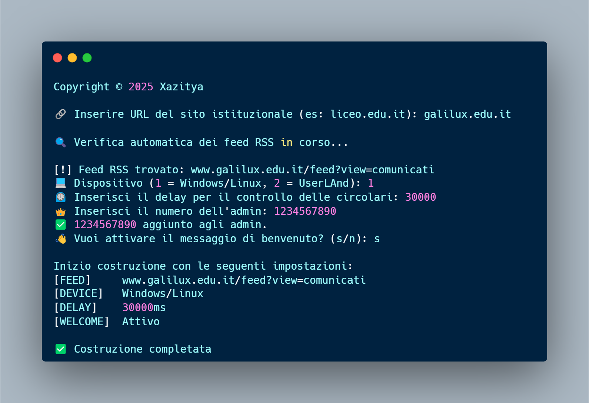

# circolari-bot-whatsapp
**Un Bot per WhatsApp, che invia aggiornamenti sulle nuove circolari** dei siti delle scuole italiane  
realizzati con il tema per WordPress “[Design Scuole Italia](https://docs.italia.it/italia/designers-italia/design-scuole-docs/it/v2022.1/risorse/tema-wordpress.html)”, direttamente nei **gruppi di classe**.

> **Non è garantito che il tuo account non venga sospeso utilizzando questa applicazione.  
> WhatsApp non consente bot o client di terze parti sulla loro piattaforma, dunque non è da considerare completamente sicuro.**

Visto che il bot **si basa sui feed RSS**, ho creato uno strumento interattivo con una CLI (Command Line Interface)  
per trovare il feed RSS delle circolari del sito (se esistente) e costruire il bot, velocizzando notevolmente il processo:


<p align="center">
  
</p>


<p align="center">
  <a href="#come-usarlo">Come usarlo</a> •
  <a href="#comandi">Comandi</a> •
  <a href="#supporto">Supporto</a> •
  <a href="#crediti">Crediti</a> •
  <a href="#licenza">Licenza</a>
</p>


# Come usarlo
Sotto sono spiegate due modalità di deploy: Windows/Linux e Android (rootless):
1) Windows/Linux
     - **Installa** l'ultima versione di LTS di [**Node.js**](https://nodejs.org/) e [**Git**](https://git-scm.com/)
     - **Verifica** le **installazioni** dal terminale con i seguenti comandi
       
       ``` bash
       $ node -v
       $ git --version
       ```
     - Sempre dal terminale, **clona il repository**:
       
       ``` bash
       git clone https://github.com/root-xazitya/circolari-bot-whatsapp.git
       ```

     - **Naviga nella directory**  
     
       ``` bash
       cd circolari-bot-whatsapp
       ```
     - **Installa le** [**dipendenze necessarie**](#crediti)  
       
       ``` bash
       npm install
       ```
     - **Avvia il costruttore interattivo**
  
       ``` bash
       npm run build
       ```
     - Durante la configurazione, puoi decidere se mandare un
       messaggio di benvenuto quando il bot viene aggiunto in un gruppo.  
       Il messaggio di benvenuto ha questo aspetto:
       <p align="center">
          
        </p>
       Il nome del bot è personalizzabile. 
     - Una volta terminata la configurazione, **avvia il client**
  
       ``` bash
       npm start
       ```
     - **(Opzionale)** usa pm2 per eseguire il codice 24/7
  
       ``` bash
       npm install pm2
       ```
       ``` bash
       pm2 start client.js
       ```
       Visualizza lo stato e i log in tempo reale (necessareio per scannerizzare il codice QR) con
       ``` bash
       pm2 status
       ```
       ``` bash
       pm2 logs
       ```
     - **Scannerizza il codice QR sul terminale con WhatsApp**

          *Tocca i tre puntini* (⋮) *in alto a destra (Android) o Impostazioni (iOS)*
    
          *Seleziona Dispositivi collegati → Collega un dispositivo*
    
          *Scannerizza il codice QR mostrato nel terminale (il codice cambia ogni 20 secondi)*
       
      - **A questo punto il bot è collegato all'account WhatsApp.**
        
        
2) UserLAnd: applicazione per eseguire distribuzioni di Linux su Android 

     - Scarica [UserLAnd](https://play.google.com/store/apps/details?id=tech.ula&hl=en_ZA) sul dispositivo da cui si vuole deployare l'applicazione
     - Tra le distribuzioni, selezionare Debian > connection type 'Terminal'
     - Seguire la mia guida: https://pastebin.com/TYE6SneP

# Comandi
I comandi possono essere eseguiti **solo dagli admin**, sia in un gruppo, che in una chat privata col bot.    

1) **!ping**
    - Restituisce 'Online.'  
      
2) **!log {numero_di_righe]**
    - Restituisce n righe di log.  
      
3) **!latest**
    - Restituisce l'ultima circolare che trova:
       <p align="left">
          
       </p>  
       
4) **!sendall** {messaggio_da_inviare}
    - Invia un messaggio in tutti i gruppi in cui il bot è membro: 
       <p align="left">
          
       </p>  
       
5) **!admin list**
    - Restituisce una lista con tutti i numeri admin:
       <p align="left">
          
       </p>  
       
6) **!admin add** {numero_da_aggiungere_agli_admin}
    - Aggiunge un numero alla lista degli admin:
        <p align="left">
          
        </p>  

7) **!admin remove** {numero_da_rimuovere_dagli_admin}
    - Rimuove un numero dalla lista degli admin.
  
# Supporto
Esempio di feed supportato:
       <p align="left">
          
       </p>    
       
Esempio di feed NON supportato:
       <p align="left">
          
       </p>    

        
# Crediti
Questo progetto utilizza le seguenti librerie open-source:

  - [axios](https://github.com/axios/axios)
  - [date-fns](https://github.com/date-fns/date-fns)
  - [qrcode-terminal](https://github.com/gtanner/qrcode-terminal)
  - [rss-parser](https://github.com/rss-parser/rss-parser)
  - [whatsapp-web.js](https://github.com/pedroslopez/whatsapp-web.js) – Libreria per interagire con WhatsApp Web tramite Node.js.

Queste librerie sono distribuite sotto diverse licenze open-source.  
Consulta i rispettivi repository per maggiori dettagli.

# Licenza

Questo progetto è distribuito sotto la [MIT License](LICENSE).

---
E-mail circolaribotwhatsapp@protonmail.com &nbsp;&middot;&nbsp;
GitHub [root-xazitya](https://github.com/root-xazitya) &nbsp;&nbsp;

